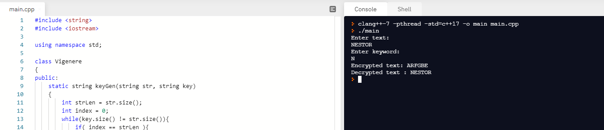
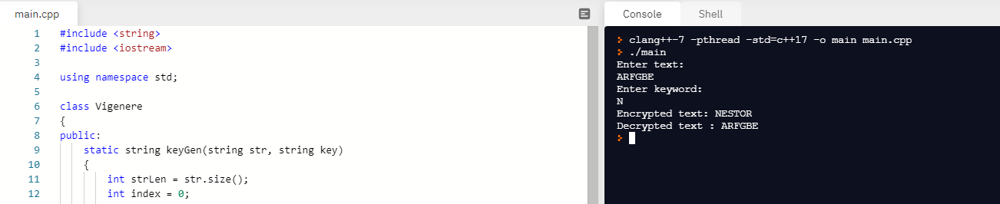

<h2>Vigenere-Cipher</h2>
 

This was a project that we created for our computer science class in college. This project creates an encrypted message that users could see and can use for security purposes.

<ul>
  <li>

<b>In the first picture I chose to encrypt my name: "NESTOR" </b>

  </li>
  <li>
    <b>Check out that my encrypted message is: "ARFGBE"</b>
  </li>
 </ul> 
  

<ul>
  <li>

<b>In the second picture i put my encrypted message: "ARFGBE" </b>

  </li>
    <li>

<b>The result should be the encrypted text.</b>

    
  </li>

 </ul> 

 <b>Nkkkkkkkkkkkkc</b>

